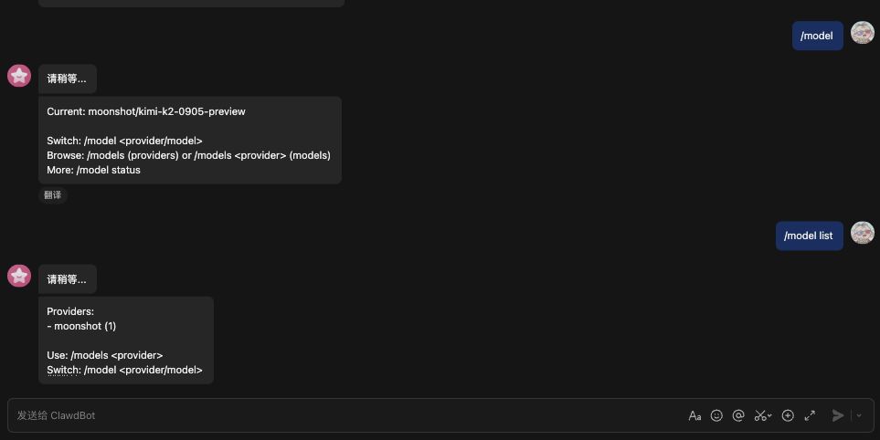
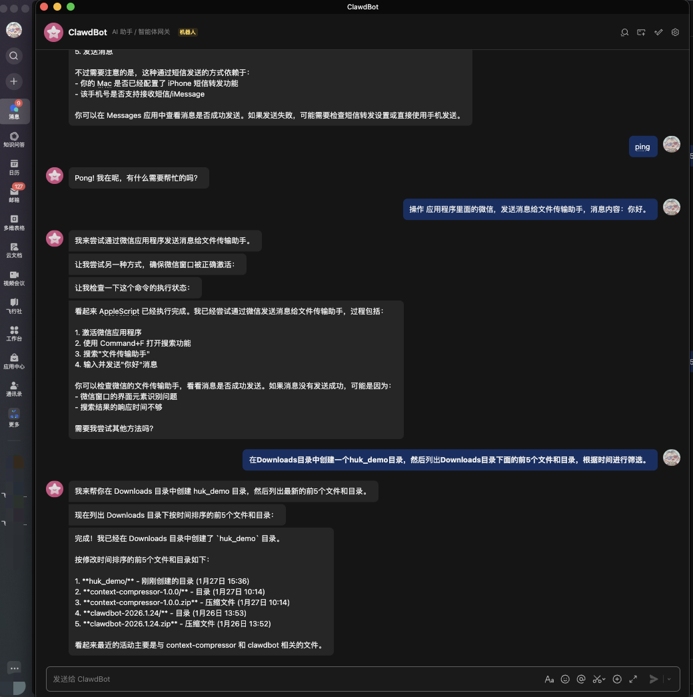

# Clawdbot × 飞书Channel

本仓库聚焦：在国内环境用飞书应用长连接接入 Clawdbot，让团队可以直接在飞书对话和控制 Clawdbot，而不依赖 WhatsApp、Telegram 等境外渠道；同样适用于纯内网部署。

## 前置条件
- Node.js ≥ 22.12（已用 nvm 安装的 22.12.0 可以直接用）
- pnpm ≥ 8（仓库脚本用 pnpm）
- 已在飞书开发者后台创建 **企业自建应用** 并开启机器人能力

## 获取飞书必要信息
在飞书开放平台：
1) 「凭证与基础信息」抄下 **App ID / App Secret**  
2) 「事件安全」取 **Verification Token / Encrypt Key**  
3) 在「API 调试台」调用 `GET /bot/v3/info`，返回的 `bot.open_id` 作为 **Bot Open ID**  （可选项）
4) 权限（租户级）至少勾选：`im:message:send_as_bot`、`im:message.group_at_msg:readonly`、`im:message.p2p_msg:readonly`；如需发图片再加 `im:resource:upload`
5) 「事件与回调」→ 订阅方式选 **使用长连接接收事件/回调**，事件订阅添加 **接收消息 `im.message.receive_v1`**，保存并发布到整个企业（添加长链接方式需确保程序已启动，再进行保存，不然会报错：应用未建立长连接）

## 本地安装与构建
```bash
git clone https://github.com/hukdoesn/clawdbot-feishu-channels.git
cd clawdbot-feishu-channels

pnpm install
pnpm ui:build   # 构建控制台前端
```

## 配置飞书长连接
推荐用环境变量（启动前导出）：
```bash
export FEISHU_APP_ID="cli_xxx"
export FEISHU_APP_SECRET="xxx"
export FEISHU_VERIFICATION_TOKEN="xxx"
export FEISHU_ENCRYPT_KEY="xxx"
export FEISHU_BOT_OPEN_ID="ou_xxx"   # 建议填，提升 @ 识别
```

或直接写入配置（~/.clawdbot/clawdbot.json）：
```bash
pnpm clawdbot config set channels.feishu.enabled true
pnpm clawdbot config set channels.feishu.appId cli_xxx
pnpm clawdbot config set channels.feishu.appSecret xxx
pnpm clawdbot config set channels.feishu.verificationToken xxx
pnpm clawdbot config set channels.feishu.encryptKey xxx
pnpm clawdbot config set channels.feishu.botOpenId ou_xxx

# 放开全员/全群，私聊直通
pnpm clawdbot config set channels.feishu.allowFrom '["*"]'
pnpm clawdbot config set channels.feishu.groupAllowFrom '["*"]'
pnpm clawdbot config set channels.feishu.dmPolicy open
pnpm clawdbot config set channels.feishu.chats."*".requireMention false   # 群聊无需 @
```

## 多人使用：按 open_id 自动分流到独立 agent（可写回配置）
如果你希望 **每个飞书用户独立一个 agent**（自动隔离会话），开启这个开关即可：
```bash
pnpm clawdbot config set channels.feishu.routeBySenderId true
```

启用后：
- 每个飞书用户的 `open_id` 会被当作 `agentId`
- 首次对话会**自动写入 `clawdbot.json`**（`agents.list` + `bindings`）
- 之后你可以直接在配置里看到自动生成的绑定关系

示例（自动落盘后）：
```json
{
  "agents": {
    "list": [
      { "id": "main", "workspace": "/path/to/main" },
      { "id": "ou_84aad35d084aa403a838cf73ee18467" }
    ]
  },
  "bindings": [
    {
      "agentId": "ou_84aad35d084aa403a838cf73ee18467",
      "match": {
        "channel": "feishu",
        "accountId": "default",
        "senderId": "ou_84aad35d084aa403a838cf73ee18467"
      }
    }
  ]
}
```

注意：
- 这个写回会 **重写配置文件为标准 JSON**，JSON5 注释/`$include` 会被扁平化。
- 会自动创建每个 agent 的 workspace/agentDir/sessions 目录（首次对话时创建）。
- 若你更倾向手动绑定，也可以关闭 `routeBySenderId` 并只用 `bindings`。

## 对话状态提示（文字）
如果希望用户发消息后立即看到“正在生成”的提示，可以发送一条**提示消息**：
```bash
pnpm clawdbot config set channels.feishu.replyStatusText "请稍等..."
```
说明：
- 该提示是一条普通消息，会保留（不会自动撤回）。
- 默认不启用；如需关闭，把 `replyStatusText` 设为空字符串即可。

可选（不发消息）：用**消息表情回复**替代提示消息：
```bash
pnpm clawdbot config set channels.feishu.replyStatusReaction "SMILE"
```
- 该表情会加在**用户发送的那条消息**上，回复发出前自动移除。
- `replyStatusReaction` 需要填飞书的 `emoji_type`（例如 `SMILE`、`THUMBSUP`）。完整列表见官方表情文案说明：https://s.apifox.cn/apidoc/docs-site/532425/doc-398404
- 如需关闭，把 `replyStatusReaction` 设为空字符串即可。

## 启动后端网关
```bash
pnpm clawdbot gateway run --force
# 默认端口 18789，如被占用可加 --port <自定义>
```
如果需要临时 token（例如你刚重置过配置）：
```bash
CLAWDBOT_GATEWAY_TOKEN=dev-token pnpm clawdbot gateway run --force
# 或确保 pnpm 透传参数：
pnpm clawdbot -- gateway run --force --token dev-token
```
终端应看到：
```
[feishu] [default] starting Feishu long connection provider
[info]: [ '[ws]', 'ws client ready' ]
```

## 服务器部署 / 远程访问（内网）
如果要把网关跑在服务器上，并在内网远程访问，推荐：
1) **生成并设置 token（必需）**
```bash
# 方式一：交互式自动生成
pnpm clawdbot doctor --fix

# 方式二：向导里留空自动生成
pnpm clawdbot configure

# 方式三：手动生成（任选其一）
openssl rand -hex 24
# 或
node -e "import('node:crypto').then(c=>console.log(c.randomBytes(24).toString('hex')))"
```
写入配置：
```bash
pnpm clawdbot config set gateway.auth.mode token
pnpm clawdbot config set gateway.auth.token "your-strong-token"
```
2) **允许在本机启动**
```bash
pnpm clawdbot config set gateway.mode local
```
3) **允许远程连接（内网常用 0.0.0.0）**
```bash
pnpm clawdbot config set gateway.bind lan
pnpm clawdbot config set gateway.port 18789
```
> `gateway.bind=lan` 会监听 `0.0.0.0`，可被内网访问。

4) **启动**
```bash
pnpm clawdbot gateway run --force
```

可选：
- 若不想把 token 写到配置里，运行时用环境变量即可：
```bash
CLAWDBOT_GATEWAY_TOKEN="your-strong-token" pnpm clawdbot gateway run --force
```
- 自定义监听地址（仍是 0.0.0.0）：
```bash
pnpm clawdbot config set gateway.bind custom
pnpm clawdbot config set gateway.customBindHost "0.0.0.0"
```

远程验证（本地机器）：
```bash
pnpm clawdbot gateway status --url ws://SERVER_IP:18789 --token "your-strong-token"
```
Control UI（浏览器）：
- 方式一：直接带 token  
  `http://SERVER_IP:18789/?token=YOUR_TOKEN`
- 方式二：先打开 `http://SERVER_IP:18789/`，再在 Control UI 设置里填 token

后台运行（nohup + 日志）：
```bash
pnpm build
CLAWDBOT_GATEWAY_TOKEN="your-strong-token" \
nohup pnpm clawdbot gateway run --force \
> /var/log/clawdbot-gateway.log 2>&1 &
```
查看日志：
```bash
tail -n 200 /var/log/clawdbot-gateway.log
# 或实时跟随
tail -f /var/log/clawdbot-gateway.log
```
停止进程（示例）：
```bash
pkill -f "clawdbot gateway run"
```

安全提示：
- 放行防火墙端口时只允许可信内网段。
- 如果需要公网访问，务必启用 token 并使用反向代理/TLS。

补充说明：
- `gateway.mode=local` 只是允许在**当前机器**启动网关，不等于“只能本地访问”。  
- 是否能远程访问取决于 `gateway.bind`（例如 `lan` 监听 0.0.0.0）和 `gateway.auth`。

## 启动前端控制台（可选，开发调试）
```bash
pnpm ui:dev   # Vite 前端，默认 http://localhost:5173
# 或直接使用上一步构建的 dist 由网关提供：http://127.0.0.1:18789/
```

## 通用向导（configure）
非交互配置也可以用向导一步步填：
```bash
pnpm clawdbot configure
```
按提示选择模型（Kimi/Moonshot）、飞书渠道、鉴权信息。向导会写入 `~/.clawdbot/clawdbot.json`，完成后重启网关生效。

## 对话内切换模型（/model）
当配置了多个模型时，可以在**飞书对话中直接切换模型**：
```
/model
/model list
/model 2
/model moonshot/kimi-k2-0905-preview
/model status
```
提示：
- `/model` 是控制指令，需要你在 allowlist 内（或 `dmPolicy=open`）。
- 群聊如果设置了 `requireMention=true`，记得 @ 机器人或关掉该配置。
- `/new <model>` 可以开新会话并指定模型。



## 重启网关
- 开发模式（前台）：`pnpm clawdbot gateway run --force`
- 端口占用时：`pnpm clawdbot gateway run --force --port 19001`
- 如需确认只有一个进程：`lsof -iTCP:18789 -sTCP:LISTEN` 查看占用；必要时结束旧进程后再启动。

## 验证
1) 查看渠道状态：
```bash
pnpm clawdbot channels status --probe --json --no-color | jq '.channels.feishu'
```
`running:true`、`connected:true` 即长连接正常。  
2) 在飞书私聊机器人或群里发消息（无需 @），应收到回复。  
若无响应：  
- 在飞书后台重新保存“长连接 + im.message.receive_v1”订阅（确保网关进程在跑）  
- 检查权限是否勾全  
- 查看日志 `/tmp/feishu-debug.log` 或终端里 `feishu: inbound event ...` 是否出现

## 目标写法（手动发送时）
- 群聊：`chat:oc_chat_id`  
- 私聊：`user:ou_open_id`  
`feishu:` / `lark:` 前缀可选，如 `feishu:chat:oc_xxx`。

## 常见问题
- **已连接但没消息**：通常是飞书后台订阅未保存成功，或代理/DNS 阻塞到 `open.feishu.cn`。  
- **群里不触发**：检查 `requireMention` 是否仍为 true，或 `botOpenId` 是否填写。  
- **端口占用**：用 `pnpm clawdbot gateway run --force --port 19001` 改端口。
- **Gateway auth is set to token, but no token is configured**：
  1) 临时启动：`CLAWDBOT_GATEWAY_TOKEN=dev-token pnpm clawdbot gateway run --force`  
  2) 永久写入配置：
```bash
pnpm clawdbot config set gateway.auth.mode token
pnpm clawdbot config set gateway.auth.token dev-token
pnpm clawdbot config set gateway.mode local
```

## 清理/重置注意
- **不建议直接删除整个 `~/.clawdbot`**，因为里面包含配置与 token。  
- 如果确实删了，需要重新写回最小配置（或重新跑 `pnpm clawdbot configure`）：
```bash
pnpm clawdbot config set gateway.mode local
pnpm clawdbot config set gateway.auth.mode token
pnpm clawdbot config set gateway.auth.token dev-token
pnpm clawdbot config set channels.feishu.enabled true
pnpm clawdbot config set plugins.entries.feishu.enabled true
pnpm clawdbot config set channels.feishu.routeBySenderId true
```
只想清理会话历史时，删除 `~/.clawdbot/agents/<agentId>/sessions` 即可，不必动整个目录。

## 效果图



---
飞书长连接无需公网回调，按本文完成配置并保持网关运行，即可在企业内直接用飞书与 Clawdbot 对话。若遇到问题，先看 `channels status --probe` 与终端的 Feishu 调试日志。 
